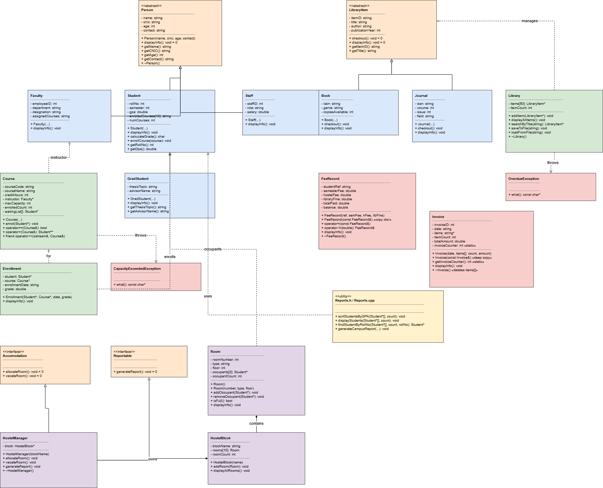

# Smart Campus Management System (SCMS)

## Project Info
- Student: [Zainab_Amir] | Roll No: [25-cs-104] | Course: OOP | HITEC University Taxila
- Student: [Laiba_Javed] | Roll No: [25-cs-104] | Course: OOP | HITEC University Taxila
## Project Description
Smart Campus Management System (SCMS) is a C++ console application that manages the core operations of a university campus. It handles student, faculty, and staff records, course enrollment, library cataloging, fee and invoice management, and hostel room allocation. The system is built using full object-oriented design, demonstrating inheritance hierarchies, polymorphism, operator overloading, exception handling, and file persistence. It simulates a real-world campus management workflow in a single integrated application.

## OOP Concepts Demonstrated

| # | Concept | Where Implemented |
|---|---------|-------------------|
| 1 | Classes & Objects | Used throughout all six modules |
| 2 | Encapsulation (getters/setters) | All classes (private/protected fields with public getters) |
| 3 | Constructors (default, param, copy) | Person, Course, FeeRecord, Invoice |
| 4 | Destructors | Library, HostelManager, Invoice |
| 5 | Single Inheritance | `Student : public Person` |
| 6 | Multi-level Inheritance | `GradStudent : public Student : public Person` |
| 7 | Multiple Inheritance | `HostelManager : public Accomodation, public Reportable` |
| 8 | Virtual Inheritance | Demonstrated in Module 5 design to avoid the diamond problem |
| 9 | Abstract Classes & Pure Virtual | Person, LibraryItem, Accomodation, Reportable |
| 10 | Runtime Polymorphism | `displayInfo()` called via base class pointers (`Person*`, `LibraryItem*`) |
| 11 | Operator Overloading | Course (`==`, `<<`), FeeRecord (`-=`) |
| 12 | Friend Functions | Used for `operator<<` in Course |
| 13 | Static Members | `Invoice::invoiceCounter` |
| 14 | Copy Constructor (Deep Copy) | FeeRecord |
| 15 | Copy Constructor and Destructor | Invoice (deep copies dynamically allocated items array) |
| 16 | Search Functions | `searchByTitle()` in Library, `findStudentByRollNo()` in Reports |
| 17 | Array-based Collections | Library class manages array of LibraryItem pointers |
| 18 | Arrays of Objects | Used in Student (enrolledCourses), Room (occupants), HostelBlock (rooms) |
| 19 | Exception Handling | `CapacityExceededException`, `OverdueException` with try/catch |
| 20 | File I/O (fstream) | Library catalog saved/loaded via `saveToFile()` / `loadFromFile()` |
| 21 | Reporting & Utilities | Reports.h / Reports.cpp - consolidated campus report |
| 22 | Memory Management | `new` / `delete` used in Library, Invoice, HostelManager |
| 23 | Sorting and Searching | `std::sort` and `std::find_if` in Reports module |
| 24 | Composition | HostelBlock's Room objects composed inside HostelManager |
| 25 | Aggregation | Course holds a `Faculty*` reference (instructor) |

## Modules

1. **Person Hierarchy** - Abstract `Person` base class with `Student`, `GradStudent`, `Faculty`, and `Staff` derived classes demonstrating inheritance and polymorphism.
2. **Course & Enrollment Management** - `Course` and `Enrollment` classes with operator overloading and custom exception handling for enrollment capacity.
3. **Library System** - Abstract `LibraryItem` with `Book` and `Journal` derived classes; `Library` manages the catalog with file persistence.
4. **Fee & Finance Management** - `FeeRecord` with deep copy semantics and `Invoice` with static auto-incrementing IDs.
5. **Hostel Management** - `Room`, `HostelBlock`, and `HostelManager` demonstrating multiple inheritance and composition.
6. **Reporting & Utilities** - Consolidated campus reports with sorting and searching using STL algorithms.

## How to Compile & Run

```bash
g++ -std=c++17 src/main.cpp src/person/*.cpp src/course/*.cpp src/library/*.cpp src/finance/*.cpp src/hostel/*.cpp src/utils/*.cpp -o scms
./scms
```

## UML Class Diagram


## GitHub Repository
https://github.com/zainab6491245-arch/HITEC-OOP-SCMS-104


